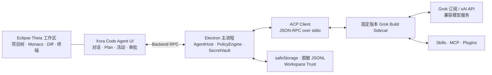

<div align="center">
  
  <h1>Xora Code</h1>
  <p><strong>开源的桌面 Grok 编程 Agent 客户端</strong></p>
  <p>
    基于 Eclipse Theia、Electron、ACP 与 Grok Build，<br />
    把项目理解、代码修改、终端执行与可审查的 Agent 工作流放进同一个桌面工作台。
  </p>

  <p>
    <a href="#当前状态"></a>
    <a href="LICENSE"></a>
    
    <a href="https://github.com/agentclientprotocol/agent-client-protocol"></a>
  </p>

  <p>
    <a href="#主要功能">主要功能</a> ·
    <a href="#快速开始">快速开始</a> ·
    <a href="#技术架构">技术架构</a> ·
    <a href="#安全与权限">安全与权限</a> ·
    <a href="#发行通道">发行通道</a> ·
    <a href="#参与项目">参与项目</a>
  </p>
</div>

---

Xora Code 将 [Grok Build](https://github.com/xai-org/grok-build) 的 Agent 能力带入完整的桌面编码环境。你可以一边浏览项目、编辑代码和使用终端，一边让 Agent 分析代码库、制定计划、调用工具并完成改动；所有关键操作都通过清晰的活动记录、Diff 和权限请求呈现。

它不是简单地把终端嵌进窗口：Grok Build 作为固定版本的 sidecar 由 Electron 主进程托管，前端通过 [Agent Client Protocol（ACP）](https://github.com/agentclientprotocol/agent-client-protocol) 接收流式消息、计划、工具调用、权限请求和会话事件。凭据、进程和最终权限裁决不会交给渲染页面。

> [!IMPORTANT]
> Xora Code 当前处于 **v0.1 Alpha**。核心桌面工作区和 Agent 流程已经可用，但兼容来源 MCP 汇总、组件在线更新和正式签名发行仍在完善。Preview 安装包未经平台正式签名，仅适合开发、测试与提前体验，请勿用于生产环境。

## 为什么是 Xora Code

- **桌面优先**：项目树、编辑器、搜索、Diff、终端和 Agent 固定在同一个工作台中。
- **围绕 Grok Build**：保留 Grok Build 的代码理解、文件操作、命令执行、网络搜索与扩展能力，并通过 ACP 提供图形界面。
- **过程可见**：计划、文件读写、搜索、终端、网络、Skills、MCP 和 Plugins 操作按类型展示，不让 Agent 在黑盒里工作。
- **用户掌控**：支持请求审批与完全访问两种应用级权限模式；选择会跨项目、会话、窗口和应用重启保持，敏感操作仍由 Electron 主进程进行最终裁决。
- **开放源码**：桌面应用、ACP 客户端、Agent UI、权限策略、会话存储、构建和发布脚本均在本仓库开放。

## 主要功能

| 能力 | 说明 |
| --- | --- |
| **完整编码工作区** | 打开文件夹或多根工作区，使用项目树、Monaco 编辑器、文件搜索、原生 Diff、终端、任务、SCM 和设置；切换目录后 Explorer 会自动恢复，不需要手动执行 `View: Explorer`。 |
| **流式 Agent 对话** | 实时显示回复、Plan、工具活动、终端输出、错误与任务状态；首个回复片段立即呈现，后续片段合并刷新，兼顾响应速度与渲染稳定性。 |
| **理解并修改项目** | Agent 可以读取和搜索项目、修改文件、执行命令、运行测试，并将变更集中到可审查的 Diff 视图。 |
| **活动与变更审阅** | 按文件、搜索、终端、网络、Skill、MCP、Plugin 分类查看操作；支持打开差异和基于文件哈希的安全撤销。 |
| **权限模式** | 默认逐项请求审批，也可开启完全访问；模式由应用级设置统一管理并持久化到本机，所有项目、会话和窗口保持一致。 |
| **会话与本地历史** | 每次打开或重新打开项目都会进入干净的新会话页；历史事件以脱敏 JSONL 保存在本地，可由用户手动恢复，崩溃后不会自动重放任务。 |
| **原生上下文压缩** | 集成 Grok Build 0.2.102 的自动上下文压缩机制；上游默认在 85% 阈值触发（可由 Grok 配置覆盖），界面仅展示 Runtime 提供的真实 Token 元数据和压缩状态，不按字符数推算。 |
| **Grok 订阅与 API** | 支持 Grok 订阅登录、xAI API Key、可编辑 Base URL、模型 ID 和上下文窗口，也可连接可信的 Grok 中转服务。 |
| **兼容模型服务** | 自定义 Provider 支持 OpenAI Responses、OpenAI Chat Completions 与 Anthropic Messages 协议，所有模型仍通过 Grok Build 运行。 |
| **图片上下文** | 可以选择或粘贴 PNG、JPEG、WebP 图片；仅在当前 ACP Runtime 明确声明图片能力时发送。 |
| **Skills / MCP / Plugins（Preview）** | 通过“Xora Code 面板右上角齿轮 → Agent 设置”进入，支持 Skill 启停与 `SKILL.md`、MCP 配置与诊断、Plugin/Marketplace 安全安装流程；兼容来源汇总仍在完善。 |

## 使用方式

1. **打开项目**：选择单个文件夹或多根工作区，并确认 Agent 的主工作目录。每次打开都会从新会话页开始；需要继续旧任务时，可从本地历史手动恢复。
2. **连接模型**：在设置中登录 Grok 订阅，或配置 xAI API、自定义 Base URL 和模型。
3. **描述任务**：在右侧 Xora Code 面板输入目标，审阅计划、工具活动、权限请求和最终 Diff。

发送任务前，Xora Code 会先执行 Save All。若文件无法保存，任务不会开始，避免 Agent 读取到与编辑器不一致的磁盘状态。

## 模型与认证

| 方式 | 适用场景 | 说明 |
| --- | --- | --- |
| **Grok 订阅** | 已使用 Grok CLI / Grok Build 的用户 | 浏览器登录和退出完全交给 Grok Build，并与本机 `~/.grok` 共享状态。 |
| **xAI API / Grok 中转** | 使用 API Key、官方接口或可信中转站 | 可修改 Base URL、API Key、协议、模型 ID 与上下文窗口。 |
| **自定义 Provider** | 使用兼容服务或内部网关 | 支持 OpenAI Responses、OpenAI Chat Completions、Anthropic Messages。 |

API Key 使用 Electron `safeStorage` 保存，不会回显到页面、日志或 Theia 设置。Linux 检测到不安全的密钥存储后仅允许当前会话使用。

## 技术架构



| 组件 | 作用 |
| --- | --- |
| [Eclipse Theia](https://github.com/eclipse-theia/theia) | 提供可扩展的桌面 IDE 外壳、编辑器、项目树、终端和工作区能力。 |
| [Electron](https://www.electronjs.org/) | 提供跨平台桌面运行时，并在主进程中托管 sidecar、密钥、权限和更新。 |
| [Grok Build](https://github.com/xai-org/grok-build) | 提供编码 Agent Runtime、工具、Skills、MCP 和 Plugins 能力。 |
| [ACP](https://github.com/agentclientprotocol/agent-client-protocol) | 连接桌面客户端与 Agent，传输会话、流式内容、工具和权限事件。 |

Xora Code 不修改 Theia Platform 核心，也不引入第二套 Agent Loop。UI 和会话协议保持 Agent 中立，当前 v0.1 的实际 Runtime 由 Grok Build 提供。

对话流沿端到端链路做了轻量调度：首个 Assistant 文本片段收到后立即跨进程呈现，后续高频片段再按短周期批量刷新，减少首字等待和连续 Markdown 重排。上下文整理则完全复用 Grok Build 0.2.102 的原生机制，Xora Code 只适配并展示 ACP 扩展事件，不在桌面端另造摘要或估算 Token。

## 安全与权限

- Electron 主进程独占 Grok Build 进程管理、密钥读取和最终权限裁决，renderer 不能直接启动程序或批准敏感操作。
- 项目默认受限；只有用户确认信任后，Agent、终端、MCP、Hooks 和可执行 Plugins 才能运行。
- `允许一次` 不会持久化；持久规则会绑定工作区、工具、路径或命令、MCP Server、sidecar 版本和有效期。
- 请求审批 / 完全访问是应用级偏好，会跨项目、会话、窗口和应用重启保持一致；renderer 不能随会话请求篡改该模式。
- 完全访问不等于绕过安全边界：Electron backend 仍会检查 Workspace Trust、当前 ACP 会话、工作区路径与符号链接边界，也不会把 sidecar 更新解释为更宽松的授权。
- 自定义 Base URL 会经过协议、地址、DNS rebinding、重定向和响应大小检查，认证信息不会跟随跨域重定向。
- 会话和诊断日志在落盘前统一脱敏；图片历史只保存安全元数据，不持久化原始 Base64 内容。
- 安全撤销仅在文件仍匹配 Agent 写入后的 SHA-256 时执行；用户继续编辑后会拒绝覆盖。

## 当前状态

### 已可体验

- Theia + Electron 桌面工作区及固定右侧 Agent 面板
- 打开或切换目录后的 Explorer 自动恢复，以及始终从新会话页开始的项目体验
- Grok Build ACP 初始化、认证、新建/加载会话、流式任务和取消
- Plan、工具活动、权限审批、Diff、安全撤销和图片输入
- 应用级持久权限模式，以及低延迟首片段流式输出
- Grok Build 原生自动上下文压缩、真实 Token 占用与压缩状态展示
- Grok 订阅、xAI API、自定义 Base URL、Provider 与模型选择
- Skills、MCP、Plugins 的设置入口与安全管理边界
- macOS、Windows、Linux 的构建配置和 CI 矩阵

### 仍在完善

- 合并 Grok 原生配置与 Claude/Cursor 兼容来源的最终生效 MCP 列表
- Skills / MCP / Plugins 在 Agent 运行期间的无中断刷新体验
- 两套 Ed25519 更新信任锚、平台代码签名、macOS 公证与正式 Release 发布

> Preview 构建不代表稳定版或生产就绪版本。登录状态由 Grok Build 与共享的 `~/.grok` 管理；Xora Code 会在启动时读取实际认证状态，而不会以“自动恢复旧会话”代替明确的新会话体验。

## 发行通道

Xora Code 将试用构建与正式分发严格分开，避免未签名产物被误认为稳定版本：

| 通道 | 平台与产物 | 发布策略 |
| --- | --- | --- |
| **Preview / Alpha** | macOS arm64/x64：DMG + ZIP；Windows x64：NSIS；Linux x64：AppImage + deb | 在对应平台的原生 GitHub Runner 上构建，发布为 **Prerelease**，不标记为 **Latest**。当前产物未经完整平台签名，仅供开发与测试。 |
| **正式 Release** | 同一桌面平台矩阵，并携带经过校验的 Grok Build sidecar、许可证、notices 与 SBOM | 工作流保持 fail-closed；只有 Apple、Windows、Linux GPG、应用更新与 sidecar 更新签名凭据全部就绪，并通过平台签名、公证及发布验收后才会开放。 |

Preview 页面会明确标注版本和提交，不会覆盖正式版更新通道。请在安装前核对 Release 说明与校验信息，并自行评估 Alpha 软件风险。

## 快速开始

### 环境要求

- Node.js 24
- Yarn Classic 1.22.22
- macOS、Windows 或 Linux
- 使用 Agent 时需要 Grok Build 0.2.102，或与固定基线兼容的本地开发二进制

### 从源码运行

```bash
git clone https://github.com/WhiteNightShadow/xora-code.git
cd xora-code

nvm use
corepack enable
corepack prepare yarn@1.22.22 --activate
yarn install --frozen-lockfile --non-interactive

yarn build
yarn start:electron
```

如果开发环境尚未将固定 sidecar 放入 `resources/sidecars/grok/`，可以仅在未打包应用中指向本地 Grok 二进制：

```bash
XORA_GROK_BINARY=/absolute/path/to/grok yarn start:electron
```

Windows PowerShell：

```powershell
$env:XORA_GROK_BINARY = "C:\absolute\path\to\grok.exe"
yarn start:electron
```

Browser 目标只用于 Fake Agent 和前端调试，不是正式产品：

```bash
yarn start:browser
```

### 测试与打包

```bash
yarn test

# 不要求完整发布凭据的当前平台预览目录
yarn package:electron:preview

# 当前平台正式安装包；会严格校验固定 Grok sidecar
yarn package:electron
```

<details>
<summary><strong>构建固定版本的 Grok Build Sidecar</strong></summary>

固定源码契约保存在 [`build/grok/sidecar.lock.json`](build/grok/sidecar.lock.json)：

- Grok Build `0.2.102`
- 公共提交 `98c3b2438aa922fbbe6178a5c0a4c48f85edc8ce`
- `SOURCE_REV=124d85bc5dc6e7805560215fcc6d5413944920e1`
- Rust `1.92.0`

推荐使用仓库包装脚本完成源码校验、原生构建、产物重命名、元数据和 notices 归档：

```bash
node build/grok/build-sidecar.mjs \
  --work-dir /absolute/path/to/temporary-build-dir \
  --target darwin-arm64 \
  --stage-dir resources/sidecars/grok
```

可用目标：`darwin-arm64`、`darwin-x64`、`linux-arm64`、`linux-x64`、`win32-x64`。构建必须在匹配的原生平台和架构上执行。

底层 Cargo 命令为：

```bash
cargo build -p xai-grok-pager-bin --profile release-dist
```

Xora Code 运行 sidecar 时固定使用：

```text
grok --no-auto-update --cwd <trusted-root> agent --no-leader stdio
```

</details>

## 仓库结构

```text
applications/
  browser/                  Browser + Fake Agent 开发目标
  electron/                 Xora Code 桌面应用与打包配置
packages/
  acp-client/               ACP JSON-RPC 客户端
  runtime-core/             Provider、权限策略、会话与更新基础能力
  fake-acp-agent/           UI 与契约测试使用的假 Agent
theia-extensions/
  product/                  产品品牌、欢迎页与桌面外壳
  xora-agent/               Agent UI 与 Electron Grok Host
build/grok/                 固定 Grok Build 源码与构建契约
build/update/               签名清单与原子组件激活
resources/sidecars/grok/    校验后的 Grok Build 产物暂存目录
```

## 技术基线

- Eclipse Theia `1.73.1`
- Electron `39.8.7`
- React `18.3.1`
- Node.js `24`
- Yarn Classic `1.22.22`
- Grok Build `0.2.102`
- Rust `1.92.0`（仅构建原生 sidecar）

关键依赖均使用精确版本，以保证本地构建、CI 和分发产物可复现。

## 参与项目

Xora Code 希望成为一个由社区共同建设的开放桌面 Agent 工作台。欢迎通过 [Issues](https://github.com/WhiteNightShadow/xora-code/issues) 提交：

- Bug 与兼容性问题
- Agent 交互与桌面体验建议
- Grok Build / ACP 能力适配
- Skills、MCP、Plugins 的展示与管理改进
- macOS、Windows、Linux 构建与发布反馈

提交代码前，请保持安全边界不被弱化：renderer 不接触密钥、不直接启动 sidecar、不绕过 Workspace Trust，也不以隐式 Git 操作覆盖用户改动。

## 开源许可

Xora Code 源码采用 [Apache License 2.0](LICENSE) 发布。

Eclipse Theia、Electron、Grok Build、VS Code 扩展及其他依赖保留各自的许可证。分发产物必须携带对应的版权、第三方 notices 和 SBOM；详见 [NOTICE](NOTICE.md)、[THIRD-PARTY-NOTICES](THIRD-PARTY-NOTICES.md) 与 [`resources/legal`](resources/legal/README.md)。

> Xora Code 是由社区独立维护的开源项目，与 xAI 不存在隶属、赞助或背书关系。“Grok”与“Grok Build”仅用于准确描述本项目与上游软件的集成及互操作关系，相关商标归其各自权利人所有。

## 致谢

感谢 [Grok Build](https://github.com/xai-org/grok-build)、[Eclipse Theia](https://github.com/eclipse-theia/theia)、[Electron](https://github.com/electron/electron) 与 [Agent Client Protocol](https://github.com/agentclientprotocol/agent-client-protocol) 社区提供的开放基础。

<div align="center">
  <sub>Built openly for a more visible, controllable and extensible Agent coding experience.</sub>
</div>
