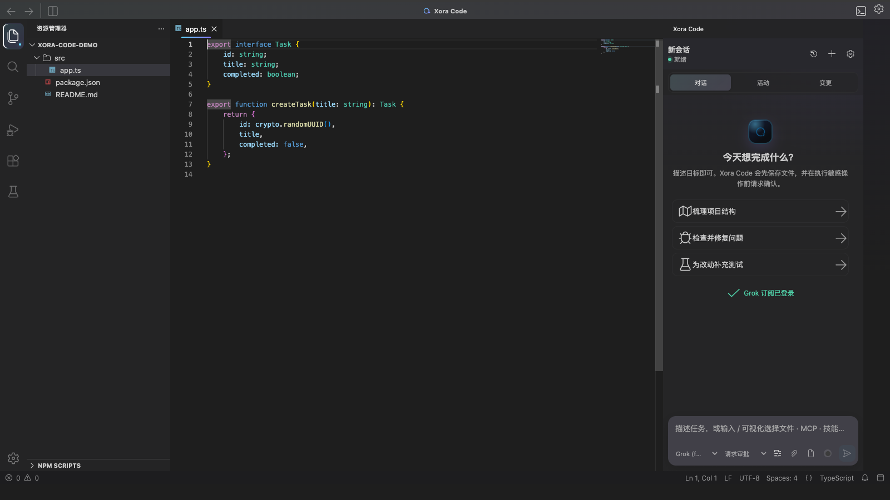
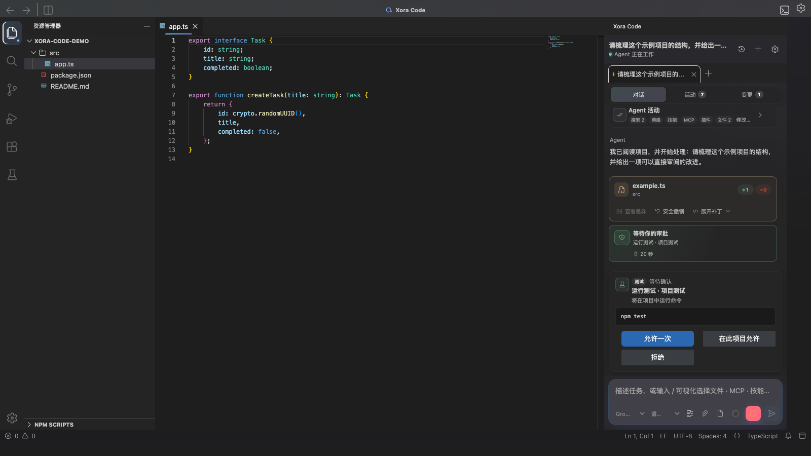
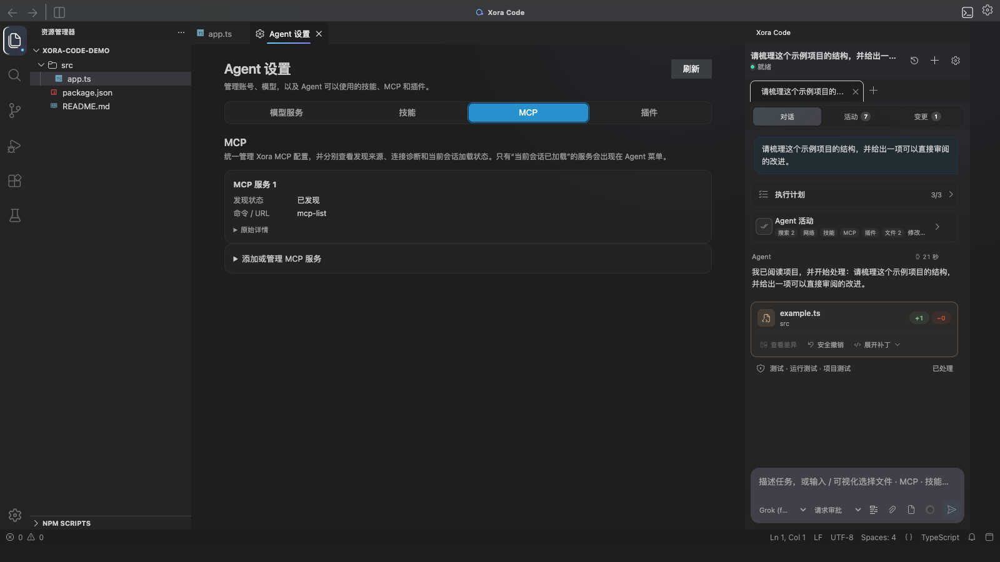
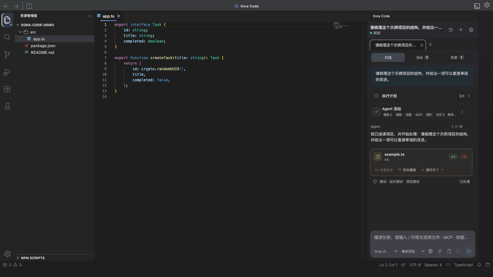
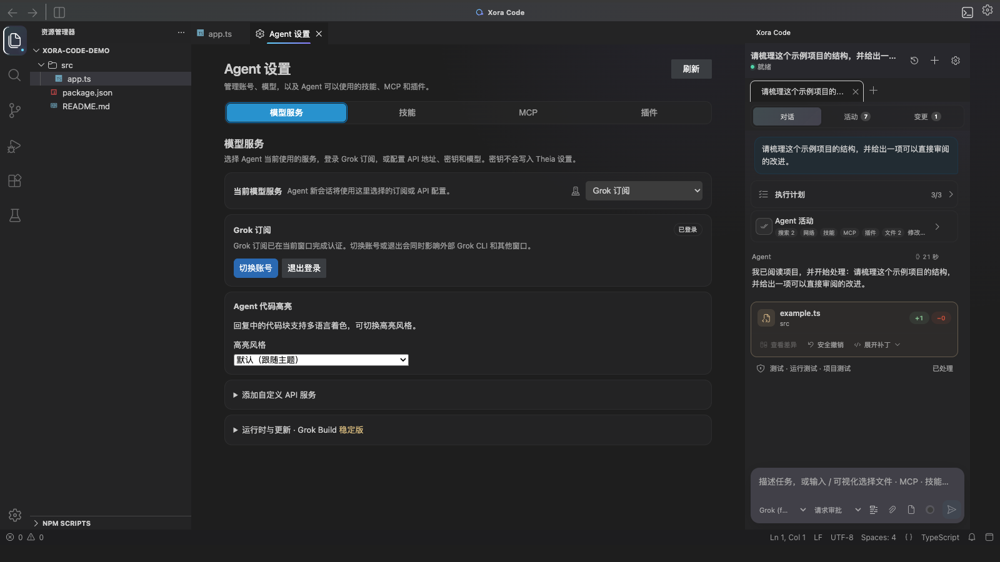
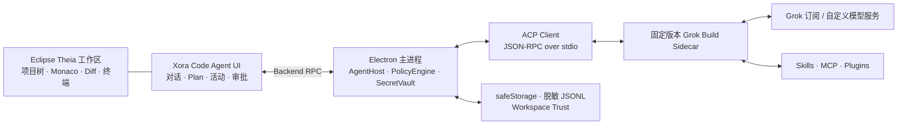

<div align="center">
  
  <h1>Xora Code</h1>
  <p><strong>开源的 Grok 桌面应用与编程 Agent 客户端</strong></p>
  <p><strong>Open-source Grok desktop app and coding agent powered by Grok Build</strong></p>
  <p>
    基于 Grok Build、Eclipse Theia、Electron 与 ACP，<br />
    在 macOS、Windows 和 Linux 上提供项目理解、代码修改、终端执行与可审查的 Agent 工作流。
  </p>

  <p>
    <a href="#当前状态"></a>
    <a href="LICENSE"></a>
    
    <a href="https://github.com/agentclientprotocol/agent-client-protocol"></a>
  </p>

  <p>
    <a href="https://github.com/WhiteNightShadow/xora-code/releases/tag/v0.2.2"><strong>下载 v0.2.2 Preview</strong></a> ·
    <a href="#主要功能">主要功能</a> ·
    <a href="#产品界面">产品界面</a> ·
    <a href="#快速开始">快速开始</a> ·
    <a href="#技术架构">技术架构</a> ·
    <a href="#安全与权限">安全与权限</a> ·
    <a href="#v022-release-notes">v0.2.2 Release Notes</a> ·
    <a href="#发行通道">发行通道</a> ·
    <a href="#参与项目">参与项目</a> ·
    <a href="#问题反馈与交流">问题反馈与交流</a>
  </p>
</div>

---

Xora Code 是一款基于 [Grok Build](https://github.com/xai-org/grok-build) 构建的开源 Grok 桌面应用，也是面向编程场景的 Grok Build GUI 客户端。它把项目树、代码编辑器、终端、流式 Agent 对话、Plan、工具活动、Diff 审阅和权限控制集中在同一个桌面工作台中。

**Xora Code is an open-source Grok desktop app and Grok Build desktop client for macOS, Windows and Linux.** It is designed for developers who want a visual, project-oriented way to use Grok for code understanding, editing, terminal tasks and reviewable Agent workflows.

它不是简单地把终端嵌进窗口：固定版本的 Grok Build sidecar 由 Electron 主进程托管，前端通过 [Agent Client Protocol（ACP）](https://github.com/agentclientprotocol/agent-client-protocol) 接收流式消息、计划、工具调用、权限请求和会话事件。凭据、进程和最终权限裁决不会交给渲染页面；UI 与会话协议仍保持 Agent 中立，并支持通过 Grok Build 接入兼容模型服务。

> Xora Code 是由社区独立维护的开源项目，不是 xAI 官方客户端，与 xAI 不存在隶属、赞助或背书关系。“Grok”与“Grok Build”仅用于准确描述本项目集成的上游软件及互操作能力。

> [!IMPORTANT]
> Xora Code 当前处于 **v0.2.2 Alpha**。核心桌面工作区、并发会话、模型接入、Skills/MCP 统一配置与可审查 Agent 流程已经可用，但组件在线更新和正式签名发行仍在完善。Preview 安装包未经平台正式签名，仅适合开发、测试与提前体验，请勿用于生产环境。

<p align="center">
  
</p>

<p align="center"><sub>项目树、代码编辑器与 Grok Agent 固定在同一桌面工作区。截图使用公开示例项目，不包含本地路径、账号或密钥。</sub></p>

## 产品界面

<table>
  <tr>
    <td width="50%" valign="top">
      
      <p align="center"><strong>可审查的 Agent 工作流</strong><br /><sub>Plan、工具活动、文件变更、耗时与命令审批集中展示。</sub></p>
    </td>
    <td width="50%" valign="top">
      
      <p align="center"><strong>统一的 Skills / MCP 管理</strong><br /><sub>查看发现来源、诊断结果、配置状态与当前会话加载状态。</sub></p>
    </td>
  </tr>
</table>

<details>
<summary><strong>查看完整 Agent 执行流程</strong></summary>
<br />
<p align="center">
  
</p>
</details>

<details>
<summary><strong>查看模型服务设置</strong></summary>
<br />
<p align="center">
  
</p>
</details>

## 为什么选择 Xora Code 作为 Grok 桌面端

- **桌面优先**：项目树、编辑器、搜索、Diff、终端和 Agent 固定在同一个工作台中。
- **围绕 Grok Build**：保留 Grok Build 的代码理解、文件操作、命令执行、网络搜索与扩展能力，并通过 ACP 提供图形界面。
- **过程可见**：计划、文件读写、搜索、终端、网络、Skills、MCP 和 Plugins 操作按类型展示；同一轮的多个工具与文件变更会合并成一个稳定活动组，并显示当前操作、状态与耗时。
- **多会话并行**：不同会话可以同时工作；每个会话独立保存草稿、附件与消息队列，切换项目或历史不会互相覆盖。
- **低等待体验**：打开项目即预热 Agent Runtime，首个回复片段优先显示，高频流式更新合并到浏览器帧，减少首发等待、界面闪屏和历史切换卡顿。
- **用户掌控**：支持请求审批与完全访问两种应用级权限模式；选择会跨项目、会话、窗口和应用重启保持。完全访问会自动批准兼容工具请求，并解除 Xora Code 的工作区路径限制。
- **开放源码**：桌面应用、ACP 客户端、Agent UI、权限策略、会话存储、构建和发布脚本均在本仓库开放。

## 主要功能

| 能力 | 说明 |
| --- | --- |
| **完整编码工作区** | 打开文件夹或多根工作区，使用项目树、Monaco 编辑器、文件搜索、原生 Diff、终端、任务、SCM 和设置；精简桌面外壳保留核心区域，右侧 Xora Code 面板始终可用，切换目录后 Explorer 自动恢复。 |
| **流式 Agent 对话** | 实时显示回复、Plan、工具活动、终端输出、错误与任务状态；首个回复片段立即呈现，后续片段按帧合并刷新。发送后回到底部，位于底部时实时跟随；上滑阅读时不抢位置，并以「有新消息 · 回到底部」提示恢复跟随。 |
| **理解并修改项目** | Agent 可以读取和搜索项目、修改文件、执行命令、运行测试，并将变更集中到可审查的 Diff 视图。 |
| **轮次化活动与变更审阅** | 同一条用户任务产生的 Plan、工具和多个文件变更共享稳定轮次 ID，并合并成一个「Agent 活动」；可按文件、搜索、终端、网络、Skill、MCP、Plugin、子 Agent 筛选。文件修改保存不可变前后快照，使用 Theia 原生双栏 Diff，恢复与安全撤销均做哈希校验。 |
| **多会话与消息队列** | 不同会话可并行执行；同一会话可连续提交多条等待消息，并可单独取消队列中的消息。编辑框文字、图片和重试状态均按会话隔离。 |
| **权限模式** | 默认逐项请求审批，也可开启全磁盘完全访问；模式由应用级设置统一管理并持久化到本机，所有项目、会话和窗口保持一致。 |
| **会话与本地历史** | 打开项目时优先恢复该工作区最近一次会话；也可随时新建、重命名或切换历史。事件以脱敏 JSONL 保存在本地，常用历史会缓存在 renderer 中以加快切换，崩溃后绝不自动重放任务。 |
| **原生上下文压缩** | 复用 Grok Build 0.2.102 的自动上下文压缩；展示 Token、压缩状态、耗时与累计次数，并持久化到会话历史。压缩是否触发由 Grok Build 根据上下文窗口决定，桌面端不按字符数推算。 |
| **Grok 订阅与自定义模型** | 设置页只保留 Grok 订阅和自定义模型服务；支持编辑 Base URL、API Key、模型 ID、上下文窗口与后端搜索，并可从兼容端点获取模型列表。 |
| **兼容模型服务** | 自定义 Provider 支持 OpenAI Responses、OpenAI Chat Completions 与 Anthropic Messages 协议，所有模型仍通过 Grok Build 运行。 |
| **全局模型选择** | 在设置中切换订阅或自定义 Provider 后，所有项目与窗口统一采用当前模型服务；可继续的历史会话会安全重绑，不兼容或恢复失败的记录保留为只读历史。 |
| **中文输入与图片上下文** | 对话输入、会话重命名完整支持中文 IME；可以选择或粘贴 PNG、JPEG、WebP 图片，且仅在当前 ACP Runtime 明确声明图片能力时发送。 |
| **语言与代码高亮** | 安装包内置常用 VS Code 语法插件，覆盖 JS/TS、C/C++、Python、JSON、Markdown、HTML/CSS、Shell、YAML、XML、SQL、Go、Rust、Java、Dockerfile 等；Agent 回复代码块可选择跟随主题、GitHub、Monokai 或 One Dark 高亮风格。 |
| **Skills / MCP / Plugins（Preview）** | 通过“Xora Code 面板右上角齿轮 → Agent 设置”管理 Skill、MCP 和 Plugin；Skills 与 MCP 使用应用统一配置源，不再随模型 Provider 丢失。支持 Skill 启停、打开 `SKILL.md` 与运行期重载；MCP 提供“已发现 / 诊断正常 / 当前会话已加载”三态、健康诊断、密钥引用和会话热更新。对话框输入 `/` 还可快速选择文件、已加载 MCP 与技能。 |
| **跨平台 Runtime** | 项目打开后立即启动或恢复 Grok Build 待机环境；ACP 初始化使用 45 秒发布级超时和有界冷启动恢复。macOS、Windows、Linux 共用明确的 Grok Home 解析与认证状态同步策略。 |

## 使用方式

1. **打开项目**：选择单个文件夹或多根工作区，并确认 Agent 主工作目录。Xora Code 会立即预热 Runtime，并恢复该项目最近一次本地会话；使用 `+` 可开始干净的新会话。
2. **连接模型**：在设置中登录 Grok 订阅，或添加带 Base URL、API Key、协议和模型 ID 的自定义模型服务。这里的选择是应用级默认值，会同步到所有项目和会话。
3. **描述任务**：在右侧 Xora Code 面板输入目标；任务执行中仍可切换到其他会话，或继续为当前会话加入等待消息。
4. **审阅结果**：查看按轮次合并的 Agent 活动、操作耗时、权限请求和文件 Diff；文件卡片可直接定位到项目树，并支持哈希保护的安全撤销。

发送任务前，Xora Code 会先执行 Save All。若文件无法保存，任务不会开始，避免 Agent 读取到与编辑器不一致的磁盘状态。

## 模型与认证

| 方式 | 适用场景 | 说明 |
| --- | --- | --- |
| **Grok 订阅** | 已使用 Grok CLI / Grok Build 的用户 | 浏览器登录和退出完全交给 Grok Build，并与本机 Grok Home 共享状态；Electron 使用明确的跨平台路径解析与文件监听同步外部认证变化。 |
| **自定义模型服务** | 使用 API Key、官方接口或可信中转站 | 可修改 Base URL、API Key、协议、模型 ID、上下文窗口与后端搜索，保存后即可设为应用当前服务。 |
| **自定义 Provider** | 使用兼容服务或内部网关 | 支持 OpenAI Responses、OpenAI Chat Completions、Anthropic Messages。 |

API Key 使用 Electron `safeStorage` 保存，不会回显到页面、日志或 Theia 设置。Linux 检测到不安全的密钥存储后仅允许当前会话使用。

Provider 与模型选择是应用级状态，而不是某个对话的临时属性。切换时会先等待或取消活跃 turn，再隔离旧 Runtime，并在可能时为历史记录安全绑定新的 ACP 会话；不兼容或恢复失败的记录保留为只读历史，绝不自动重放旧 Prompt。

## 技术架构



| 组件 | 作用 |
| --- | --- |
| [Eclipse Theia](https://github.com/eclipse-theia/theia) | 提供可扩展的桌面 IDE 外壳、编辑器、项目树、终端和工作区能力。 |
| [Electron](https://www.electronjs.org/) | 提供跨平台桌面运行时，并在主进程中托管 sidecar、密钥、权限和更新。 |
| [Grok Build](https://github.com/xai-org/grok-build) | 提供编码 Agent Runtime、工具、Skills、MCP 和 Plugins 能力。 |
| [ACP](https://github.com/agentclientprotocol/agent-client-protocol) | 连接桌面客户端与 Agent，传输会话、流式内容、工具和权限事件。 |

Xora Code 不修改 Theia Platform 核心，也不引入第二套 Agent Loop。UI 和会话协议保持 Agent 中立，当前 v0.2.2 的实际 Runtime 由 Grok Build 提供。

对话流沿端到端链路做了轻量调度：项目打开即预热 Runtime；首个 Assistant 文本片段收到后立即跨进程呈现，后续高频片段再按浏览器帧批量刷新，减少首字等待和连续 Markdown 重排。不同会话使用独立的发送队列并可并行工作，同一会话则保持 ACP Prompt 串行顺序。

每次 Prompt 都由 Electron 生成并持久化稳定 `turnId`。user、Plan、工具、Diff、Assistant 与完成事件因此可以在实时流、历史恢复和会话切换后保持同一活动边界；旧版 JSONL 没有 `turnId` 时，renderer 会根据 user / turn-completed 边界兼容推断。上下文整理完全复用 Grok Build 0.2.102 的原生机制，Xora Code 只适配并展示真实 Token 与压缩事件，不在桌面端另造摘要或按字符数估算。

## 安全与权限

- Electron 主进程独占 Grok Build 进程管理、密钥读取和最终权限裁决，renderer 不能直接启动程序或批准敏感操作。
- 项目默认受限；未信任项目可以初始化 Agent 待机连接，但不能执行 Agent 工具、终端、任务、MCP、Hooks 或可执行 Plugins，撤销信任会中断正在进行的可执行 Agent 活动。
- `允许一次` 不会持久化；持久规则会绑定工作区、工具、路径或命令、MCP Server、sidecar 版本和有效期。
- 请求审批 / 完全访问是应用级偏好，会跨项目、会话、窗口和应用重启保持一致；renderer 不能随会话请求篡改该模式。
- 完全访问会解除 Xora Code 的工作区路径和符号链接边界，允许 Agent 操作当前系统账户有权访问的整块磁盘；当前 ACP 会话与 Provider 身份校验仍由 Electron backend 执行，操作系统权限、Grok Build 的 deny 规则、Hooks、沙箱及系统管理策略仍然有效。
- 自定义 Base URL 会经过协议、地址、DNS rebinding、重定向和响应大小检查，认证信息不会跟随跨域重定向。
- 会话和诊断日志在落盘前统一脱敏；图片历史只保存安全元数据，不持久化原始 Base64 内容。
- 安全撤销仅在文件仍匹配 Agent 写入后的 SHA-256 时执行；用户继续编辑后会拒绝覆盖。

## 当前状态

### 已可体验

- 精简的 Theia + Electron 桌面工作区、自动恢复的 Explorer 与固定右侧 Xora Code 面板
- 打开项目自动恢复最近会话、新建/重命名/切换历史，以及按会话隔离的文字与图片草稿
- 多会话并行、单会话多消息排队、等待消息取消和后台权限请求处理
- 项目打开即预热 Grok Build、45 秒 ACP 初始化上限、有界冷启动恢复和低延迟首片段输出
- **对话智能滚动**（`v0.2.1`）：发送后回到底部；位于底部时实时跟随；上滑后不抢位置，并显示「有新消息 · 回到底部」
- Plan、按轮次合并的工具活动、操作耗时、权限审批、文件定位与安全撤销
- **不可变 Diff 快照 + Theia 原生双栏 Diff**（`v0.2.1`）：修改前后快照、恢复与安全撤销哈希校验，历史记录兼容 `v0.2.0`
- Grok Build 原生自动上下文压缩，以及 Token、压缩状态、耗时与累计次数展示（事件持久化到会话历史）
- **子 Agent 活动可见性**（`v0.2.1`）：识别启动 / 等待 / 停止等后台任务，可在「活动 → 子 Agent」筛选并随历史恢复
- Grok 订阅与自定义 API Provider、兼容中转站、模型获取及应用级全局模型同步
- 中文 IME 会话输入/重命名，以及受 ACP 能力约束的图片粘贴和文件选择
- 随安装包校验并分发的常用语言语法插件，以及四种 Agent 代码块高亮风格
- **Skills / MCP 统一运行时集成**（`v0.2.2`）：用户级与项目级配置统一解析，`session/new`、`session/load` 与历史恢复注入同一份 MCP；切换 Provider 不丢失，变更后热更新当前会话，UI 区分发现、诊断和真实加载状态
- macOS、Windows、Linux 的构建配置和 CI 矩阵

### 仍在完善

- 更多 MCP OAuth/远程传输兼容、Plugin Marketplace 与扩展签名体验
- 超大历史与超长单轮工具列表的进一步虚拟化，以及更多真实项目性能基准
- 子 Agent 独立控制台与逐个取消能力（当前仅活动可见；整轮取消仍是主要控制方式）
- 两套 Ed25519 更新信任锚、平台代码签名、macOS 公证与正式 Release 发布

> Preview 构建不代表稳定版或生产就绪版本。订阅登录状态由 Grok Build 与共享的 Grok Home 管理；Xora Code 会在启动时同步实际认证状态。恢复最近会话只恢复本地历史和 ACP 会话身份，绝不会自动重新发送旧任务。

## v0.2.2 Release Notes

`v0.2.2` 聚焦 Skills 与 MCP 的配置一致性、会话可用性和空闲资源占用：设置页、订阅模型、自定义模型、新会话与历史恢复现在使用同一份 Xora 集成配置，扩展变更可以在当前 Runtime 中安全生效。

> [!NOTE]
> 本节描述仓库中 `0.2.2` 的已实现范围，不代表已发布正式稳定版。具体 Preview 安装包应以对应 GitHub Prerelease 中记录的源码提交、构建链接和 SHA-256 校验信息为准。

### Skills 与 MCP

- **唯一配置源**：统一解析共享 Grok Home 与项目 `.grok/config.toml`，模型 Provider 只负责模型和凭据，不再各自持有一套 Skills/MCP 视图。
- **真实会话注入**：`session/new`、`session/load`、历史恢复与 Provider 重绑均传入同一份实际 `mcpServers`；切换 Grok 订阅或自定义模型不会清空 MCP。
- **运行期同步**：MCP 变化优先通过 Grok ACP 扩展热更新所有已加载会话；旧 Runtime 不支持时会安全重启、恢复会话且绝不重放 Prompt。Skills 变化使用运行期 reload，并同步自定义 Provider 的只读视图。
- **可验证状态**：设置页区分“已发现、诊断正常、当前会话已加载”，只有当前会话真实加载的 MCP 才会进入 Agent 快捷选择列表。
- **安全凭据绑定**：MCP 密钥只以 `secretRef` 管理，在 Electron 主进程内按工作区、Server 和配置身份解析；修改 Server 端点或命令后，旧凭据不会被错误复用。

### 体验与资源占用

- **静默同步共享状态**：共享 Grok 配置或登录文件变化后由 backend 自动刷新，不再显示要求用户“刷新管理页面”的无操作价值提示；真实失败仍会明确报告。
- **MCP 刷新防风暴**：生命周期通知使用语义去重、前沿合并、750 ms 冷却与 single-flight 查询；会话级通知只回查对应会话，避免多标签页被重复全量 `mcp/list` 扫描。
- **版本边界**：仓库、桌面应用、工作区包和 ACP 客户端标识统一更新为 `0.2.2`；Grok Build sidecar 继续锁定 `0.2.102`，不迁移既有登录与会话数据。
- **跨平台预览**：提供 macOS Apple Silicon / Intel、Windows x64 与 Linux x64 安装包；四个平台架构使用同一份前端应用内容并内嵌固定的 Grok Build `0.2.102` 原生 sidecar。
- **验证基线**：全仓 9 个工作区测试通过，Agent 测试 359/359；`yarn build`、Electron / Browser 构建与 1600×900、1280×720 真实界面交互验证通过；发布页同时提供 SHA-256 校验文件。

## v0.2.1 Release Notes

`v0.2.1` 聚焦长任务中的连续阅读与审查体验：让流式回复保持在用户期望的位置，让每一次文件变更都能稳定打开可复核的双栏差异，并把原生上下文压缩与后台子 Agent 任务从“内部能力”变成可验证、可查看的界面状态。

> [!NOTE]
> 本节描述仓库中 `0.2.1` 的已实现范围，不代表已发布正式稳定版。具体 Preview 安装包应以对应 GitHub Prerelease 中记录的源码提交、构建链接和 SHA-256 校验信息为准。

### 对话跟随与长任务阅读

- **智能跟随最新消息**：发送任务后对话自动落到底部；用户仍处于底部时，流式文本、活动和高度变化会持续跟随，无需反复手动滚动。
- **尊重主动阅读**：用户上滑查看旧内容后不再强制跳回底部；新输出继续实时接收，并通过「有新消息 · 回到底部」入口提示，一键恢复跟随。
- **会话隔离**：跟随状态、未读提示和滚动决策只属于当前显示的会话，后台会话的更新不会抢走当前阅读位置。

### Diff、上下文与子 Agent

- **可靠的双栏 Diff**：每次 Agent 修改都会保存不可变的修改前/修改后内容快照；「查看差异」使用 Theia 原生 Diff 编辑器打开对应版本，不受文件后续再次修改影响。恢复快照及执行安全撤销前会重新校验内容哈希，损坏或被替换的快照不会覆盖工作区文件。
- **历史 Diff 修复**：恢复历史时会依据文件哈希重建安全快照路径，兼容 `v0.2.0` 已生成的修改前快照；旧记录会尽力与当前工作区文件比较，`v0.2.1` 新记录则使用不可变的前后快照精确复现当次改动。快照不存在时会在 Agent 面板内给出明确错误，而不是点击无响应。
- **原生自动压缩**：由 Grok Build 0.2.102 根据上下文窗口决定并执行压缩；Xora Code 接收并持久化开始、完成、失败和取消事件，展示压缩前后 Token、耗时与累计次数。已验证事件路径与脱敏 JSONL 往返；未做「消耗超大真实上下文强制触发阈值」的端到端压测。
- **子 Agent 活动可见性**：识别 Grok Build 的启动、等待和停止子任务工具，并可在「活动 → 子 Agent」中单独筛选、随会话历史恢复。当前属于活动可见性：可查看任务调用、状态与历史，暂无独立子任务控制台或逐个取消按钮；取消当前整轮任务仍是主要控制方式。

### 版本与验证

- 仓库、桌面应用、工作区包和 ACP 客户端标识统一更新为 `0.2.1`。
- Grok Build sidecar 继续锁定 `0.2.102`；本次升级不迁移 Grok Home 或认证文件，本地历史与 Diff 快照采用向后兼容的数据格式演进。
- 验证基线：全仓 9 个工作区测试通过；Agent 测试 295/295；`yarn build` 与 Electron 构建通过；1600×900 / 1280×720 真实浏览器交互验证通过。

### 本版已知限制

- 自动压缩的触发与执行由 Grok Build 0.2.102 控制；桌面端保证事件展示与历史持久化，不保证任意对话都会触发压缩。
- 子 Agent 尚无独立控制台或单任务取消；请使用当前轮次的整体取消控制后台子任务。

## v0.2.0 Release Notes

`v0.2.0` 在首个桌面 Agent 基线上集中迭代了会话并发、冷启动性能、活动可见性、模型一致性与跨平台认证。目标是让“打开项目、输入任务、查看过程、切换会话”成为连续且无需等待用户理解内部 Runtime 状态的体验。

> [!NOTE]
> 本节描述仓库中 `0.2.0` 的已实现范围，不代表已发布正式稳定版。具体 Preview 安装包应以对应 GitHub Prerelease 中记录的源码提交、构建链接和 SHA-256 校验信息为准。

### Agent 与会话

- **最近会话自动恢复**：打开项目后直接显示该工作区最后一次会话；新建会话仍保持一键可达，历史恢复失败时保留只读本地记录。
- **多会话同时进行**：每个会话拥有独立执行 lane，不同会话可以并行发送和接收；后台任务不会因为用户查看另一个会话而失去所有权。
- **单会话消息队列**：同一会话可以连续提交多条任务，按照 FIFO 顺序交给 Grok Build；等待中的单条消息可取消，正在执行的任务继续使用 ACP cancel。
- **会话级草稿**：文本、图片、错误重试和队列状态均绑定具体会话；A → B → A 切换不会互相覆盖编辑框内容。
- **更快的历史切换**：最近历史保留有界 renderer 缓存，JSONL 回放只触发一次视图通知，并合并加载期间的增量事件。

### 性能与稳定性

- **打开项目即准备**：Runtime 在工作区附加后立即预热，而不是等用户第一次发送；首次任务复用已经就绪的 Runtime 和已加载会话。
- **有界 ACP 冷启动**：桌面初始化上限统一为 45 秒，携带冷启动提示，并只对后台预热进行一次有界恢复；用户 Prompt 永不自动重放。
- **首片段优先**：首个 Assistant 文本立即跨 Electron 边界显示，后续碎片按固定短窗口和浏览器帧合并，减少首字延迟与渲染抖动。
- **会话切换隔离**：历史加载、Provider 切换、重命名和并发状态更新使用 generation/revision 防护，迟到事件不能把当前页面切回旧会话。

### 活动、文件与上下文

- **一轮一个活动组**：Electron 为每条 Prompt 持久化 `turnId`；同一轮中交错出现的工具、文本和多个文件 Diff 只显示一个「Agent 活动」，下一轮才创建新组。
- **旧历史兼容**：没有 `turnId` 的旧 JSONL 会根据 user / turn-completed 顺序推断轮次；Provider 在不同轮次复用 `toolCallId` 也不会串组或吞掉 Diff。
- **操作状态与耗时**：正在分析、执行工具、生成回复和等待审批都有明确状态；工具完成、失败或取消后冻结真实耗时，不再长期显示“活动中”。
- **紧凑变更卡片**：多个文件连续展示在同一活动下，保留文件路径、增删行、项目树定位、原生 Diff、补丁展开和哈希保护的安全撤销。
- **原生上下文管理**：直接显示 Grok Build 报告的 Token、上下文窗口、压缩次数和最近压缩结果，不使用字符数伪造占用。

### 模型、认证与输入

- **简化服务入口**：设置页只保留 Grok 订阅和自定义模型服务，移除容易误导的旧内置 xAI/Grok API 入口。
- **兼容中转站**：自定义 Provider 支持 Base URL、API Key、协议、模型 ID、上下文窗口、后端搜索和 `/models` 获取；百万级上下文按安全整数原样保存。
- **应用级模型一致性**：设置中选择的订阅、自定义 Provider 与模型是全局默认值，跨项目和窗口保持一致；切换凭据时由 backend 安全重启 Runtime，可继续的历史会话会重绑，不兼容记录保留只读。
- **跨平台订阅状态**：macOS、Windows、Linux 使用同一显式 Grok Home 规则；外部 CLI 登录变化由 Electron 协调并广播，不由 renderer 猜测认证文件。
- **中文与图片**：对话和会话重命名支持 IME 组合态；支持 PNG、JPEG、WebP 的选择与粘贴，原始图片数据不会写入会话日志。

### 扩展、安全与桌面体验

- **Skills / MCP / Plugins**：提供最终生效 Skill、MCP 多源列表与诊断、Plugin/Marketplace 管理；在对话框输入 `/` 可快速选择文件、MCP 和技能。
- **内置语言支持**：启动和打包前校验常用 VS Code builtin grammars，避免新安装后代码文件退化为纯文本；该能力只承诺语法高亮和随内置包提供的基础语言特性，不等同于为每种语言内置完整 LSP 或调试器。
- **Agent 代码高亮**：回复中的多语言 fenced code block 支持默认（跟随主题）、GitHub、Monokai 和 One Dark 四种风格，并在本地记住选择。
- **活动标签**：文件、项目搜索、终端、测试、网络、Skill、MCP、Plugin 和子 Agent 使用结构化标签，而不是把内部 call ID 直接展示给用户。
- **全局权限模式**：请求审批 / 完全访问跨项目、会话、窗口和重启保持；后台会话的权限请求不会因切换标签而丢失。
- **精简固定布局**：采用无边框窗口策略，macOS 保留交通灯，Windows/Linux 保留系统窗口控制和可拖拽区域；隐藏 Open Editors、状态栏等冗余元素，保持 Explorer、编辑器与 Xora Code 三个核心区域。
- **低干扰反馈**：高频操作结果优先显示在 Agent 面板内，不再依赖连续的右下角全局 Toast；Workspace Trust、目录提示和主要交互文案完成中文化。
- **安全边界**：密钥由 Electron `safeStorage` 管理，Workspace Trust、路径/符号链接、Provider 网络访问、日志脱敏和权限裁决保持 fail-closed。

### 构建与发行准备

- 仓库版本与各工作区统一为 `0.2.0`，依赖基线继续精确锁定。
- Preview CI 在原生 Runner 上构建 macOS arm64/x64、Windows x64 和 Linux x64 产物，并为每个平台重新构建、校验和 smoke test 固定的 Grok Build sidecar。
- Preview 以不可覆盖的 GitHub Prerelease 发布，不会标记为 Latest，也不会生成正式更新清单或签名文件。
- 正式 Release 工作流已包含平台签名、公证、SBOM、第三方 notices 和 Ed25519 更新清单门禁；缺少任一必需凭据时会拒绝发布。

### 已知限制

- 当前仍是 Alpha：Preview 产物没有完整平台签名，不适合生产环境或高风险项目。
- Skills / MCP / Plugins 的运行期无中断刷新、更多 OAuth/远程服务兼容仍在完善。
- 仓库内尚未提供 sidecar 更新信任所需的 Ed25519 公钥；平台签名与更新签名私钥必须由发布环境单独提供。在这些门禁实际通过前，签名组件更新和正式 Release 都不可用。
- Browser 目标仅用于 Fake Agent、契约测试和前端调试，不是可替代 Electron 桌面应用的产品版本。

## 发行通道

Xora Code 将试用构建与正式分发严格分开，避免未签名产物被误认为稳定版本：

| 通道 | 平台与产物 | 发布策略 |
| --- | --- | --- |
| **Preview / Alpha** | macOS arm64/x64：DMG + ZIP；Windows x64：NSIS；Linux x64：AppImage + deb | 在对应平台的原生 Runner 或专用原生构建机上构建，发布为 **Prerelease**，不标记为 **Latest**。所有预览版至少提供 SHA-256；原生 CI 构建还会附带目标平台 CycloneDX SBOM 与构建来源。当前产物未经完整平台签名，仅供开发与测试。 |
| **正式 Release** | 同一桌面平台矩阵，并携带经过校验的 Grok Build sidecar、许可证、notices 与 SBOM | 工作流保持 fail-closed；只有 Apple、Windows、Linux GPG、应用更新与 sidecar 更新签名凭据全部就绪，并通过平台签名、公证及发布验收后才会开放。 |

Preview 页面会明确标注版本和提交，不会覆盖正式版更新通道。请在安装前核对 Release 说明与校验信息，并自行评估 Alpha 软件风险。

## 快速开始

### 下载 Preview

可从 [GitHub Releases](https://github.com/WhiteNightShadow/xora-code/releases) 获取 macOS、Windows 与 Linux 的 Preview 构建。`v0.2.2` 下载入口如下：

| 系统 | 架构 | 安装包 |
| --- | --- | --- |
| macOS | Apple Silicon（arm64） | [DMG](https://github.com/WhiteNightShadow/xora-code/releases/download/v0.2.2/Xora.Code-0.2.2-mac-arm64.dmg) · [ZIP](https://github.com/WhiteNightShadow/xora-code/releases/download/v0.2.2/Xora.Code-0.2.2-mac-arm64.zip) |
| macOS | Intel（x64） | [DMG](https://github.com/WhiteNightShadow/xora-code/releases/download/v0.2.2/Xora.Code-0.2.2-mac-x64.dmg) · [ZIP](https://github.com/WhiteNightShadow/xora-code/releases/download/v0.2.2/Xora.Code-0.2.2-mac-x64.zip) |
| Windows | x64 | [NSIS 安装包](https://github.com/WhiteNightShadow/xora-code/releases/download/v0.2.2/Xora.Code-0.2.2-win-x64.exe) |
| Linux | x64 | [AppImage](https://github.com/WhiteNightShadow/xora-code/releases/download/v0.2.2/Xora.Code-0.2.2-linux-x86_64.AppImage) · [deb](https://github.com/WhiteNightShadow/xora-code/releases/download/v0.2.2/Xora.Code-0.2.2-linux-amd64.deb) |

请在安装前下载并核对 [SHA256SUMS.txt](https://github.com/WhiteNightShadow/xora-code/releases/download/v0.2.2/SHA256SUMS.txt)。本版为未签名 Prerelease：macOS 没有 Developer ID / notarization，Windows 没有 Authenticode 产品签名，Linux 没有 GPG detached signature。

### 环境要求

- Node.js 24
- Yarn Classic 1.22.22
- macOS、Windows 或 Linux
- 使用 Agent 时需要 Grok Build 0.2.102，或与固定基线兼容的本地开发二进制

### 从源码运行

```bash
git clone https://github.com/WhiteNightShadow/xora-code.git
cd xora-code

nvm use
corepack enable
corepack prepare yarn@1.22.22 --activate
yarn install --frozen-lockfile --non-interactive

# 下载并校验编辑器内置语言插件
yarn download:plugins

yarn build
yarn start:electron
```

如果开发环境尚未将固定 sidecar 放入 `resources/sidecars/grok/`，可以仅在未打包应用中指向本地 Grok 二进制：

```bash
XORA_GROK_BINARY=/absolute/path/to/grok yarn start:electron
```

Windows PowerShell：

```powershell
$env:XORA_GROK_BINARY = "C:\absolute\path\to\grok.exe"
yarn start:electron
```

Browser 目标只用于 Fake Agent 和前端调试，不是正式产品：

```bash
yarn start:browser
```

### 测试与打包

```bash
yarn test

# 不要求完整发布凭据的当前平台预览目录
yarn package:electron:preview

# 当前平台正式安装包；会严格校验固定 Grok sidecar
yarn package:electron
```

原生 Preview 安装包生成后，使用锁定的 Anchore Syft 1.48.0 生成目标平台 CycloneDX SBOM，并将其摘要合并进该平台的校验文件：

```bash
yarn sbom:preview -- \
  --target darwin-arm64 \
  --cache-dir /absolute/path/to/pinned-tool-cache \
  --output-dir applications/electron/dist/preview-assets \
  --source-dir applications/electron/dist/mac-arm64
```

支持的目标为 `darwin-arm64`、`darwin-x64`、`linux-x64` 和 `win32-x64`。`--source-dir` 必须指向 electron-builder 生成的 unpacked 应用目录；生成器会校验其中的 `app.asar`、sidecar 与法律文件，扫描实际 payload，并与该提交的锁定依赖树合并。后者是保守清单：会包含构建依赖，以覆盖 Syft 无法从 ASAR 和 stripped Rust 二进制识别的依赖，而不会把仅有少量文件条目的 payload 扫描冒充完整分发 SBOM。工具资产 URL 与 SHA-256 固定在 [`build/sbom/syft.lock.json`](build/sbom/syft.lock.json)，下载、解包、版本检查和 Syft 执行均不经过动态 Shell。

<details>
<summary><strong>构建固定版本的 Grok Build Sidecar</strong></summary>

固定源码契约保存在 [`build/grok/sidecar.lock.json`](build/grok/sidecar.lock.json)：

- Grok Build `0.2.102`
- 公共提交 `98c3b2438aa922fbbe6178a5c0a4c48f85edc8ce`
- `SOURCE_REV=124d85bc5dc6e7805560215fcc6d5413944920e1`
- Rust `1.92.0`

推荐使用仓库包装脚本完成源码校验、原生构建、产物重命名、元数据和 notices 归档：

```bash
node build/grok/build-sidecar.mjs \
  --work-dir /absolute/path/to/temporary-build-dir \
  --target darwin-arm64 \
  --stage-dir resources/sidecars/grok
```

可用目标：`darwin-arm64`、`darwin-x64`、`linux-arm64`、`linux-x64`、`win32-x64`。构建必须在匹配的原生平台和架构上执行。

底层 Cargo 命令为：

```bash
cargo build -p xai-grok-pager-bin --profile release-dist
```

Xora Code 运行 sidecar 时固定使用：

```text
grok --no-auto-update --cwd <trusted-root> agent --no-leader stdio
```

</details>

## 仓库结构

```text
applications/
  browser/                  Browser + Fake Agent 开发目标
  electron/                 Xora Code 桌面应用与打包配置
packages/
  acp-client/               ACP JSON-RPC 客户端
  runtime-core/             Provider、权限策略、会话与更新基础能力
  fake-acp-agent/           UI 与契约测试使用的假 Agent
theia-extensions/
  product/                  产品品牌、欢迎页与桌面外壳
  xora-agent/               Agent UI 与 Electron Grok Host
build/grok/                 固定 Grok Build 源码与构建契约
build/update/               签名清单与原子组件激活
resources/sidecars/grok/    校验后的 Grok Build 产物暂存目录
```

## 技术基线

- Eclipse Theia `1.73.1`
- Electron `39.8.7`
- React `18.3.1`
- Node.js `24`
- Yarn Classic `1.22.22`
- Grok Build `0.2.102`
- Rust `1.92.0`（仅构建原生 sidecar）

关键依赖均使用精确版本，以保证本地构建、CI 和分发产物可复现。

## 参与项目

Xora Code 希望成为一个由社区共同建设的开放桌面 Agent 工作台。欢迎通过 [Issues](https://github.com/WhiteNightShadow/xora-code/issues) 提交：

- Bug 与兼容性问题
- Agent 交互与桌面体验建议
- Grok Build / ACP 能力适配
- Skills、MCP、Plugins 的展示与管理改进
- macOS、Windows、Linux 构建与发布反馈

提交代码前，请保持安全边界不被弱化：renderer 不接触密钥、不直接启动 sidecar、不绕过 Workspace Trust，也不以隐式 Git 操作覆盖用户改动。

## 问题反馈与交流

产品使用、功能建议和兼容性问题请优先通过 [GitHub Issues](https://github.com/WhiteNightShadow/xora-code/issues) 反馈，便于公开追踪、复现与协作解决。

需要中文社区交流时，也可以通过微信联系：

**微信号：** `han8888v8888`（加好友请备注「xora-code」）

## 开源许可

Xora Code 源码采用 [Apache License 2.0](LICENSE) 发布。

Eclipse Theia、Electron、Grok Build、VS Code 扩展及其他依赖保留各自的许可证。分发产物必须携带对应的版权、第三方 notices 和 SBOM；详见 [NOTICE](NOTICE.md)、[THIRD-PARTY-NOTICES](THIRD-PARTY-NOTICES.md) 与 [`resources/legal`](resources/legal/README.md)。

> Xora Code 是由社区独立维护的开源项目，与 xAI 不存在隶属、赞助或背书关系。“Grok”与“Grok Build”仅用于准确描述本项目与上游软件的集成及互操作关系，相关商标归其各自权利人所有。

## 致谢

感谢 [Grok Build](https://github.com/xai-org/grok-build)、[Eclipse Theia](https://github.com/eclipse-theia/theia)、[Electron](https://github.com/electron/electron) 与 [Agent Client Protocol](https://github.com/agentclientprotocol/agent-client-protocol) 社区提供的开放基础。

<div align="center">
  <sub>Built openly for a more visible, controllable and extensible Agent coding experience.</sub>
</div>
